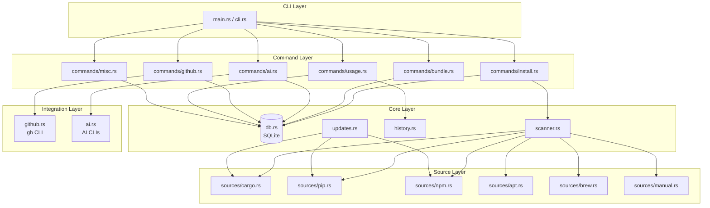

# Hoard Architecture

This document describes the internal architecture of the hoard tool manager.

## System Overview



## Module Responsibilities

### CLI Layer

#### `main.rs` (952 lines)
Entry point and command dispatch. Parses CLI arguments and routes to appropriate command handlers.

#### `cli.rs` (455 lines)
Clap-based command definitions. Defines all CLI commands, subcommands, and arguments.

### Command Layer

| Module | Lines | Responsibility |
|--------|-------|----------------|
| `commands/install.rs` | 614 | Safe command execution, install/uninstall/upgrade |
| `commands/bundle.rs` | 592 | Bundle CRUD and installation |
| `commands/ai.rs` | 377 | AI provider commands |
| `commands/github.rs` | 479 | GitHub sync and fetch |
| `commands/usage.rs` | 326 | Usage tracking and analytics |
| `commands/misc.rs` | 550 | Export, import, doctor, edit |

### Core Layer

#### `db.rs` (~1100 lines)
SQLite database operations using rusqlite. Handles:
- Tool CRUD operations
- Bundle management
- Usage tracking
- GitHub info caching
- Label management

**Key Types:**
```rust
pub struct Database { conn: Connection }

// Input struct for GitHub info (avoids many-argument functions)
pub struct GitHubInfoInput<'a> {
    pub repo_owner: &'a str,
    pub repo_name: &'a str,
    pub description: Option<&'a str>,
    pub stars: i64,
    pub language: Option<&'a str>,
    pub homepage: Option<&'a str>,
}
```

#### `models.rs` (383 lines)
Core data structures:

```rust
pub enum InstallSource {
    Cargo, Apt, Snap, Npm, Pip, Brew, Manual, Unknown
}

pub struct Tool {
    pub id: Option<i64>,
    pub name: String,
    pub description: Option<String>,
    pub category: Option<String>,
    pub source: InstallSource,
    pub install_command: Option<String>,
    pub binary_name: Option<String>,
    pub is_installed: bool,
    pub is_favorite: bool,
    pub notes: Option<String>,
    pub created_at: DateTime<Utc>,
    pub updated_at: DateTime<Utc>,
}

pub struct Bundle {
    pub id: Option<i64>,
    pub name: String,
    pub description: Option<String>,
    pub tools: Vec<String>,
    pub created_at: DateTime<Utc>,
}
```

#### `scanner.rs`
System scanning for installed tools. Maintains `KNOWN_TOOLS` - a curated list of popular CLI tools with metadata.

#### `history.rs` (470 lines)
Shell history parsing for usage tracking:
- Fish: `~/.local/share/fish/fish_history`
- Bash: `~/.bash_history`
- Zsh: `~/.zsh_history`

### Integration Layer

#### `github.rs` (370 lines)
GitHub API integration via `gh` CLI:
- Rate limit awareness (5000/hour core, 30/minute search)
- Repository search with language filtering
- Topic-to-category mapping

#### `ai.rs`
AI provider integration supporting:
- Claude (Anthropic)
- Gemini (Google)
- Codex (OpenAI)
- Opencode

### Source Layer

Each source implements the `PackageSource` trait:

```rust
pub trait PackageSource {
    fn name(&self) -> &'static str;
    fn scan(&self) -> Result<Vec<Tool>>;
    fn install_command(&self, package: &str) -> String;
    fn uninstall_command(&self, package: &str) -> String;
    fn fetch_description(&self, package: &str) -> Option<String>;
    fn supports_updates(&self) -> bool;
    fn check_update(&self, package: &str) -> Result<Option<String>>;
}
```

## Database Schema

```sql
-- Core tools table
CREATE TABLE tools (
    id INTEGER PRIMARY KEY,
    name TEXT UNIQUE NOT NULL,
    description TEXT,
    category TEXT,
    source TEXT NOT NULL,
    install_command TEXT,
    binary_name TEXT,
    is_installed INTEGER DEFAULT 0,
    is_favorite INTEGER DEFAULT 0,
    notes TEXT,
    created_at TEXT NOT NULL,
    updated_at TEXT NOT NULL
);

-- Tool bundles
CREATE TABLE bundles (
    id INTEGER PRIMARY KEY,
    name TEXT UNIQUE NOT NULL,
    description TEXT,
    created_at TEXT NOT NULL
);

CREATE TABLE bundle_tools (
    bundle_id INTEGER REFERENCES bundles(id) ON DELETE CASCADE,
    tool_name TEXT NOT NULL,
    PRIMARY KEY (bundle_id, tool_name)
);

-- Usage tracking
CREATE TABLE tool_usage (
    tool_id INTEGER PRIMARY KEY REFERENCES tools(id) ON DELETE CASCADE,
    use_count INTEGER DEFAULT 0,
    last_used TEXT,
    first_seen TEXT NOT NULL
);

-- GitHub info cache
CREATE TABLE tool_github (
    tool_id INTEGER PRIMARY KEY REFERENCES tools(id) ON DELETE CASCADE,
    repo_owner TEXT NOT NULL,
    repo_name TEXT NOT NULL,
    description TEXT,
    stars INTEGER DEFAULT 0,
    language TEXT,
    homepage TEXT,
    updated_at TEXT NOT NULL
);

-- Labels (from GitHub topics)
CREATE TABLE tool_labels (
    tool_id INTEGER REFERENCES tools(id) ON DELETE CASCADE,
    label TEXT NOT NULL,
    PRIMARY KEY (tool_id, label)
);
```

## Security Considerations

### Command Injection Prevention

The `SafeCommand` struct in `commands/install.rs` prevents shell injection:

```rust
pub struct SafeCommand {
    program: &'static str,
    args: Vec<String>,
    display: String,
}

// Validation functions
pub fn validate_package_name(name: &str) -> Result<()>
pub fn validate_version(version: &str) -> Result<()>
```

**Validation Rules:**
- Package names: alphanumeric, `-`, `_`, `/`, `@`, `.` only
- Max length: 128 characters
- No path traversal (`..`)
- No shell metacharacters

### Path Traversal Prevention

Export paths are validated to prevent directory traversal:

```rust
if path.components().any(|c| matches!(c, Component::ParentDir)) {
    bail!("Output path cannot contain '..' components");
}
```

## Performance Optimizations

### N+1 Query Prevention

Several functions use single queries instead of N+1 patterns:

```rust
// Instead of: for each category, query count
// Use: single GROUP BY query
pub fn get_category_counts(&self) -> Result<Vec<(String, usize)>> {
    self.conn.prepare(
        "SELECT category, COUNT(*) FROM tools
         WHERE category IS NOT NULL
         GROUP BY category"
    )
}

// Bundle loading with LEFT JOIN
pub fn list_bundles(&self) -> Result<Vec<Bundle>> {
    // Single query fetches bundles + tools together
}
```

### DRY Helpers

Common operations extracted to helpers:

```rust
// Datetime parsing
fn parse_datetime(s: String) -> DateTime<Utc>

// Tool mapping from database row
fn tool_from_row(row: &Row) -> Result<Tool>
```

## Testing Strategy

- **96 unit tests** covering all modules
- Tests use in-memory SQLite databases
- Tempfile for history parsing tests
- Mock-free design (tests real implementations)

```bash
cargo test                    # Run all tests
cargo test db::tests          # Run database tests
cargo test --lib              # Library tests only
```

## Error Handling

Uses `anyhow` for error propagation with context:

```rust
Command::new(self.program)
    .args(&self.args)
    .status()
    .with_context(|| format!("Failed to execute: {}", self.display))
```

## Configuration Files

| File | Purpose |
|------|---------|
| `~/.config/hoard/config.toml` | AI provider settings |
| `~/.config/hoard/topic-mapping.toml` | GitHub topic to category mapping |
| `~/.config/hoard/prompts/` | Custom AI prompts |
